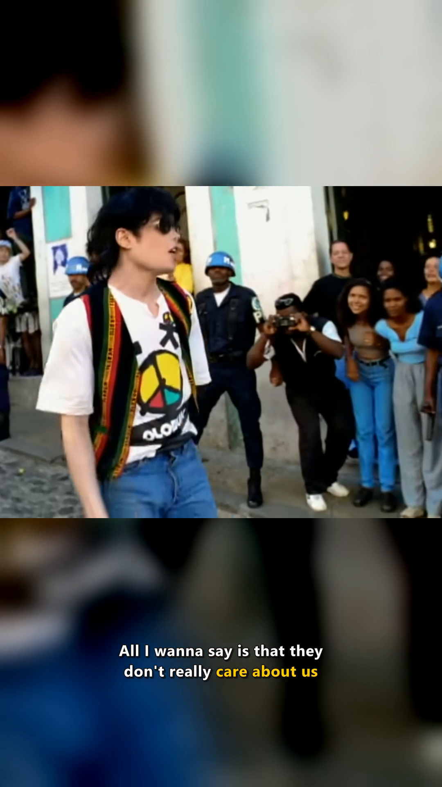
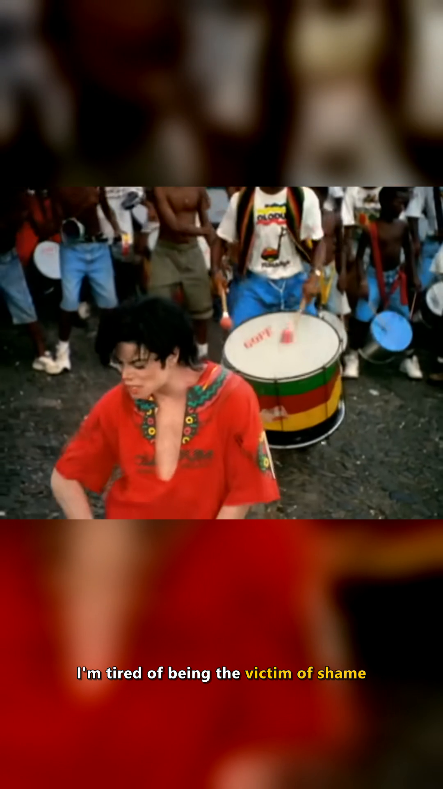
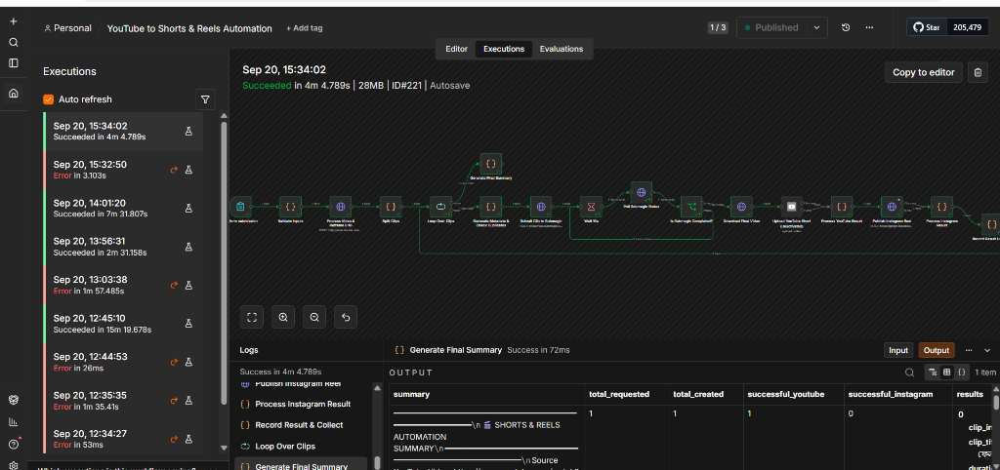
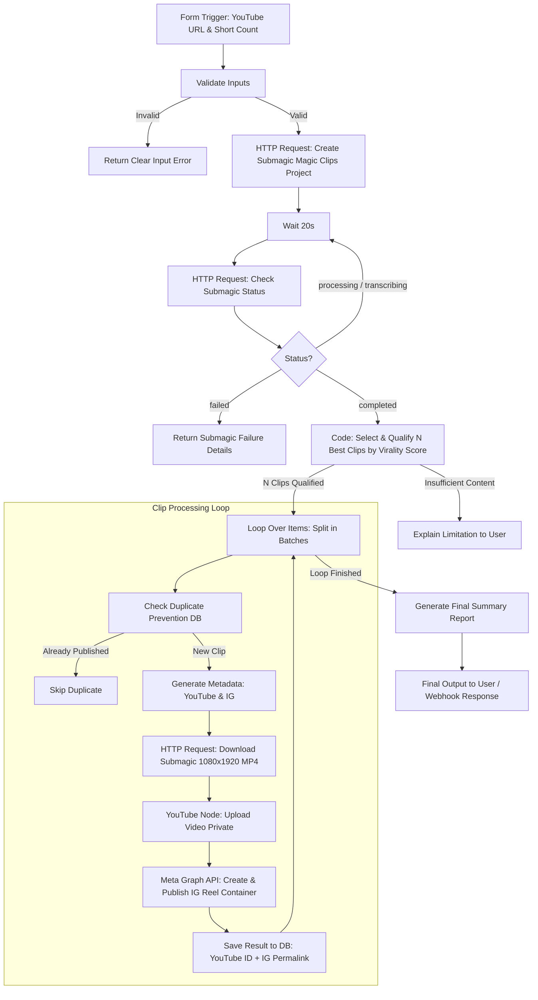

# Media Automation: YouTube to Shorts & Reels Pipeline

[](https://www.python.org/)
[](https://fastapi.tiangolo.com/)
[](https://ffmpeg.org/)
[](https://n8n.io/)
[](https://github.com/yt-dlp/yt-dlp)

An end-to-end, automated media processing and distribution engine that transforms long-form YouTube content into polished, viral **9:16 vertical Shorts and Reels**. It handles video downloading, automated transcript extraction, heuristic virality scoring, dual-layer vertical reframing, high-precision ASS subtitle rendering, and multi-platform publishing.

---

## Output Gallery

Here is a sample of rendered vertical output generated by the processing engine:

| Clean Intro Card | Synchronized Lyrics with Gold Accents | 9:16 Vertical Composition |
| :---: | :---: | :---: |
|  |  |  |
| *Minimalist black intro with smooth typography* | *Subtitles with warm gold keyword highlights* | *Blurred background + centered foreground* |

---

## Workflow Canvas

The pipeline is orchestrated using an **n8n workflow** that seamlessly bridges user inputs, the local FastAPI media processor, AI captions, and platform APIs.

<div align="center">
  
</div>

> **Ready-to-use Workflow**: Import [`workflow/youtube_shorts_reels_automation.json`](workflow/youtube_shorts_reels_automation.json) directly into your n8n workspace.

---

## Architecture & Workflow Structure



### Detailed Component Specifications

1. **User Input (`n8n-nodes-base.formTrigger`)**:
   - `youtube_url`: String/URL, required (`https://www.youtube.com/watch?v=...`)
   - `short_count`: Number of shorts to extract (default: `2`, configurable up to `10`)
   - `template_name`: Dynamic caption style (`Hormozi 2`, `Adrian`, `Devin`, `Ali`, `Sara`, `Beast`)
   - `privacy_status`: Target YouTube visibility (`private`, `unlisted`, `public`)

2. **Input Validation (`n8n-nodes-base.code`)**:
   - Sanitizes URL and validates standard YouTube and youtu.be regular expression patterns.
   - Enforces positive integer bounds on `short_count`.
   - Returns clear, formatted error message if inputs fail validation.

3. **Submagic & Media Processor Video Pipeline**:
   - **Submagic API Integration**: Creates a magic clips project (`POST /v1/projects/magic-clips`) and periodically polls every 15–20s until transcription and reframing complete.
   - **Local High-Performance Engine (`media_processor.py`)**: Local microservice endpoint (`POST http://host.docker.internal:5050/api/process-video`) providing `yt-dlp` stream ingestion, automated transcript parsing, dual-layer FFmpeg 9:16 reframing, and ASS subtitles.

4. **Virality Scoring & Clip Selection**:
   - Evaluates candidate segments based on hook strength, pacing, sentiment, and shareability scores.
   - Selects the top $N$ ranked clips and formats them for parallel or sequential processing.

5. **Looping & Duplicate Prevention**:
   - Splits batch into single clip iterations.
   - Checks deduplication store by `(source_video_id, clip_start, clip_end)` to prevent redundant rendering or duplicate publishing.

6. **Social Media Distribution**:
   - **YouTube Shorts (`n8n-nodes-base.youTube`)**: Uploads video binary directly to YouTube with high-CTR titles, hashtags, and description.
   - **Instagram Reels (`Meta Graph API`)**: Submits video to `v21.0/me/media` with `REELS` media type and publishes container.

7. **Executive Summary Reporting**:
   - Aggregates all live links, virality scores, upload statuses, and execution metrics into a clean executive summary report.

---

## Key Features

- **Automated Ingestion**: Downloads the highest quality streams via `yt-dlp` while bypassing bot verification hurdles.
- **Transcript Extraction & Language Detection**: Automatically retrieves timed subtitles across multiple languages using `youtube-transcript-api`.
- **Intelligent Hook & Virality Scoring**: Computes viral potential based on keyword frequency, pacing, sentiment, question structures, and punctuation density.
- **Dual-Layer 9:16 Canvas**:
  - **Background**: Scaled, cropped, darkened (`brightness=-0.14`), and blurred (`boxblur=14:14`) to fill standard 1080x1920 mobile viewport.
  - **Foreground**: Centered and scaled (`1080x810`) to preserve composition without cropping heads or key action.
- **Broadcast Standard Audio**: Applies two-pass EBU R128 loudness normalization (`loudnorm=I=-14:TP=-1.5:LRA=11`) for standard mobile playback volume.
- **Native ASS Subtitle Engine**: Generates micro-timed ASS files with smooth 120ms alpha fades and warm gold accent highlights (`&H0000CCFF&`).
- **Turnkey Automation**: Packaged as a FastAPI service that communicates effortlessly with n8n or Docker containers.

---

## File Structure

```
media-automation/
├── docs/
│   └── screenshots/
│       ├── n8n_workflow_canvas.png
│       ├── output_intro_card.png
│       ├── output_lyric_bridge.png
│       └── output_lyric_chorus.png
├── workflow/
│   └── youtube_shorts_reels_automation.json  # Importable n8n workflow
├── media_processor.py                        # Core FastAPI microservice
├── render_music_short.py                     # Standalone FFmpeg lyric short renderer
├── generate_lyrics_subtitles.py              # ASS subtitle script generator
├── lyrics.ass                                # Subtitle styling & script template
├── start_media_processor.bat                 # One-click Windows startup script
├── requirements.txt                          # Python dependencies
├── .gitignore                                # Git ignore rules
└── README.md                                 # Documentation & blueprint
```

---

## Getting Started

### 1. Prerequisites
- **Python 3.9+**
- **FFmpeg** (installed and added to your system `PATH` with `libass` support). Test by running:
  ```bash
  ffmpeg -version
  ```

### 2. Clone and Install
```bash
git clone https://github.com/Adityadwis-26/media-automation.git
cd media-automation

# (Optional) Create virtual environment
python -m venv venv
venv\Scripts\activate

# Install dependencies
pip install -r requirements.txt
```

### 3. Launch the Media Processor Service

#### On Windows:
Double-click `start_media_processor.bat` or run:
```cmd
start_media_processor.bat
```

#### On Linux / macOS:
```bash
python media_processor.py
```
The service will start on port `5050`.
- Swagger UI / OpenAPI Docs: [http://localhost:5050/docs](http://localhost:5050/docs)
- Docker n8n URL: `http://host.docker.internal:5050/api/process-video`

---

## n8n Workflow Setup

1. Open your n8n instance (default: `http://localhost:5678`).
2. Click **Add workflow** > **Import from file...**.
3. Select [`workflow/youtube_shorts_reels_automation.json`](workflow/youtube_shorts_reels_automation.json).
4. Configure credentials (optional, for direct social publishing):
   - **YouTube OAuth2**: For automated upload to YouTube Shorts.
   - **Meta Graph API**: For automated publishing to Instagram Reels.
   - **Submagic API Key**: For AI-driven animated captions and b-roll zooms.
5. Activate the workflow and trigger using the **Form Submission** node!
